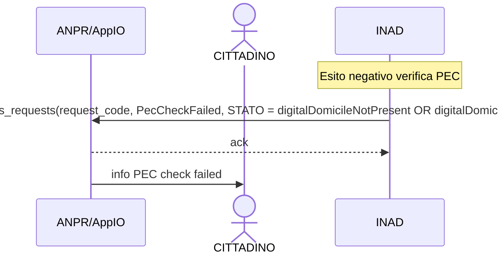

```mermaid
 sequenceDiagram
  participant A as ANPR/AppIO
  actor C as CITTADINO
  participant I as INAD

  Note over I: Esito negativo verifica PEC

  I ->> A: receive_status_requests(request_code, PecCheckFailed, STATO = digitalDomicileNotPresent OR digitalDomicilePresent)
  A -->> I: ack
  A ->> C: info PEC check failed

```

[torna a readme.md](../readme.md)