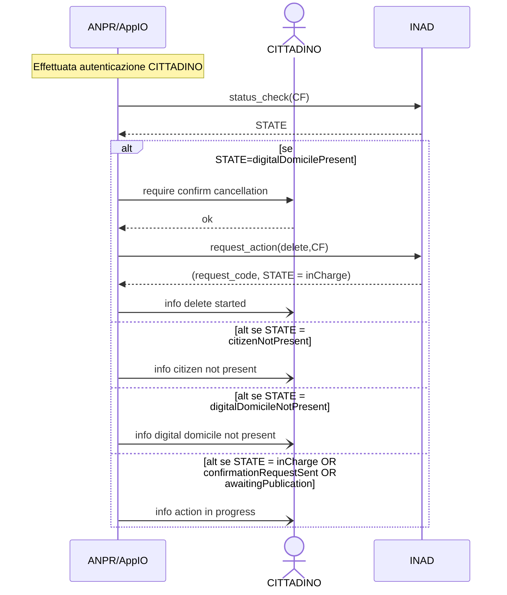

**UC004 - notifica richiesta cessazione volontaria domicilio digitale di un CITTADINO x PEC**

```mermaid
 sequenceDiagram
  participant A as ANPR/AppIO
  actor C as CITTADINO
  participant I as INAD

  Note over A: Effettuata autenticazione CITTADINO

  A ->> I: status_check(CF)
  I -->> A: STATE

  alt se STATE=digitalDomicilePresent 
    A ->> C: require confirm cancellation
    C -->> A: ok
    A ->> I: request_action(delete,CF)
    I -->> A: (request_code, STATE = inCharge)
    A -) C: info delete started
  
  else alt se STATE = citizenNotPresent
    A -) C: info citizen not present

  else alt se STATE = digitalDomicileNotPresent
    A -) C: info digital domicile not present

  else alt se STATE = inCharge OR confirmationRequestSent OR awaitingPublication
    A -) C: info action in progress

  end
```

[torna a readme.md](../readme.md)